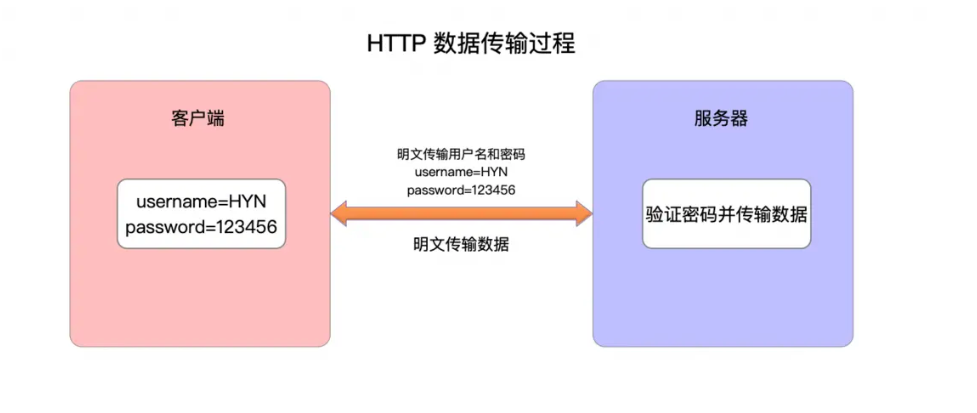

# 网络协议层

1. 应用层协议：HTTP & HTTPS

2. 网络层协议：TCP/IP

3. 传输层协议：TCP/IP

### HTTPS

1. 图解

### HTTP 

1. 图解

### 加密

1. 加密过程：

   1. 客户端发送请求，建立连接，发送HTTP请求报文。
   2. 服务器接收请求，返回HTTP响应报文。
   3. 客户端接收响应，解密响应报文。
   4. 客户端发送加密的请求报文。
   5. 服务器接收加密的请求报文，解密请求报文。
   6. 服务器处理请求，返回加密的响应报文。
   7. 客户端接收加密的响应报文，解密响应报文。
   8. 客户端发送响应报文。
   9. 连接结束。

2. 加密方式：
- 对称加密：指的是明文在加密和暗文在解密过程中都使用同一个密钥。

- 非对称加密：一般使用两个密钥，一个是称为‘公钥’，另一个叫做‘私钥’。
            公钥和私钥是配对的，其最大的缺点就是运算速度慢，比对称加密慢许多。
            私钥就可以对密文解密也可以对明文进行加密，公钥也一样。一般情况来说客户端可以获得公钥，而服务器一般使用私钥。 

